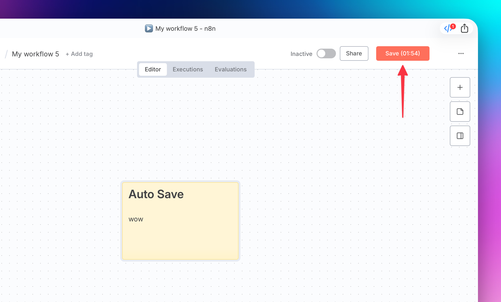

# n8n Auto-save Script v6.1

Tampermonkey/Greasemonkey userscript for automatic n8n workflow saving with visual countdown timer.



## 📋 Overview

This script automatically saves your selfhosted n8n workflows every 3 minutes, displaying a visual countdown timer directly on the "Save" button. The script intelligently detects when to pause auto-saving (e.g., when editing nodes) to avoid interrupting your workflow.
Selfhosted n8n v1.111.0

## ✨ Key Features

### 🔄 Automatic Saving
- **Interval**: Every 3 minutes (180 seconds)
- **Visual Timer**: Displayed directly on the Save button
- **Retry Mechanism**: Retries after 5 seconds on failure
- **Timer Format**: `Save (02:45)` - shows remaining time

### ⏸️ Smart Pause System
Automatically pauses saving when:

- **Node Editing** - when node editor is open (detected by URL)
- **Node Creator** - when new node creation dialog is open
- **Modal Windows** - any Element UI dialogs
- **Popup States** - when body is locked by overlay

During pause, displays: `Save (02:45 ⏸)`

### 🎨 Visual Indicators

| State | Button Display | Description |
|-------|----------------|-------------|
| Active Timer | `Save (02:45)` | Normal operation, shows remaining time |
| Paused | `Save (02:45 ⏸)` | Saving paused, button semi-transparent |
| Saving | `Save` | Save in progress, button dimmed |

## 🔧 Installation

### Step 1: Install a userscript manager

**Chrome/Edge:**
- [Tampermonkey](https://chrome.google.com/webstore/detail/tampermonkey/dhdgffkkebhmkfjojejmpbldmpobfkfo)
- [Violentmonkey](https://chrome.google.com/webstore/detail/violentmonkey/jinjaccalgkegednnccohejagnlnfdag)

**Firefox:**
- [Tampermonkey](https://addons.mozilla.org/firefox/addon/tampermonkey/)
- [Greasemonkey](https://addons.mozilla.org/firefox/addon/greasemonkey/)
- [Violentmonkey](https://addons.mozilla.org/firefox/addon/violentmonkey/)

**Safari:**
- [Userscripts](https://apps.apple.com/app/userscripts/id1463298887)

### Step 2: Install the script

1. Copy the script code
2. Open your userscript manager dashboard
3. Create a new script and paste the code
4. Save and activate the script

### Step 3: Configure domains

By default, the script works on these domains:
```
https://n8n-domain.com/*
http://n8n-domain.com/*
https://*.n8n-domain.com/*
http://*.n8n-domain.com/*
```

Modify domains in the script header for your needs:
```javascript
// @match        https://your-n8n-domain.com/*
// @match        http://your-n8n-domain.com/*
```

## ⚙️ Configuration

Settings are located in the `CONFIG` object:

```javascript
const CONFIG = {
  INTERVAL_SEC: 180,        // Auto-save interval in seconds (default 3 min)
  RETRY_DELAY: 5000,        // Delay on save error in ms (5 sec)
  SEARCH_INTERVAL: 500,     // Save button search interval in ms
  UPDATE_INTERVAL: 1000,    // Timer update frequency in ms (1 sec)
  MIN_BUTTON_WIDTH: '110px', // Minimum button width for stable display
  MAX_SHADOW_DEPTH: 5,      // Maximum Shadow DOM search depth
  MODAL_DEBOUNCE_MS: 400,   // Delay for modal detection stabilization
};
```

## 🖥️ Compatibility

### Browsers
- ✅ **Chrome** - Tampermonkey, Violentmonkey
- ✅ **Firefox** - Greasemonkey, Tampermonkey, Violentmonkey  
- ✅ **Safari** - Userscripts (with additional fallback mechanisms)
- ✅ **Edge** - Tampermonkey, Violentmonkey

### Technical Features
- **Shadow DOM** - Support for element search in Shadow DOM
- **History API** - URL change tracking without page reload
- **MutationObserver** - Reactive DOM change monitoring
- **Fallback Mechanisms** - For older browsers without modern APIs

## 🔍 How It Works

### Architecture
The script consists of several modules:

```
AutoSaveApp
├── ModalDetector     # Modal window and pause state detector
├── ButtonManager     # Save button management and visual effects
├── TimerManager      # Timer and schedule management
└── DOMHelper         # DOM and Shadow DOM utilities
```

### Logic Flow

1. **Initialization**: Find Save button, set up event handlers
2. **Main Loop**: 
   - Check pause state
   - Update visual timer
   - Perform save when time expires
3. **Modes**:
   - **Search Mode**: Active when Save button is not found
   - **Main Mode**: Normal operation with timer

### Pause Detection

The script checks several conditions to determine when to pause:

```javascript
// URL contains open node ID
const isNodeEditorOpen = () => {
  const match = window.location.href.match(/\/workflow\/[^\/]+\/([^\/\?#]+)/);
  return !!(match && match[1]);
}

// Visible modal elements
const modalElements = {
  nodeCreator: '[data-test-id="node-creator"]',
  overlay: '.el-overlay, .el-overlay-dialog, [role="dialog"][aria-modal="true"]',
  bodyLocked: document.body.classList.contains('el-popup-parent--hidden')
};
```

## 🎯 Usage Examples

### Basic Usage
Simply install the script - it will start working automatically on specified domains.

### Custom Interval
To change auto-save interval to 5 minutes:
```javascript
const CONFIG = {
  INTERVAL_SEC: 300, // 5 minutes
  // ... other settings
};
```

### Disable for Specific Pages
Add a check at the beginning of the script:
```javascript
// Don't run on settings pages
if (window.location.pathname.includes('/settings')) {
  return;
}
```

## 🐛 Troubleshooting

### Save Button Not Found
- Ensure you're on a workflow editing page
- Check that n8n has fully loaded
- Open browser console to view script messages

### Timer Not Displaying
- Verify the script is active in your userscript manager
- Ensure the domain matches those specified in `@match`
- Clear browser cache and reload the page

### Saving Not Working
- Check n8n access permissions
- Ensure the workflow has actually been modified
- Check console for JavaScript errors

### Safari-Specific Issues
Safari uses additional fallback mechanisms:
- Increased initialization delays
- Modern API support checks
- Alternative element search methods

## 📝 Changelog

### v6.1
- Improved Safari compatibility
- Additional fallback mechanisms
- Performance optimization
- Extended error handling

## 📄 License

This script is freely distributed for personal and commercial use.

## 🤝 Support

If you encounter issues:
1. Check the "Troubleshooting" section
2. Open browser console to view error messages
3. Ensure you're using current versions of n8n and userscript manager

---

> ⚠️ **Important**: This script is designed to improve workflow convenience but doesn't replace manual saving of important changes. Always verify that critical changes are manually saved.
MIT License
Copyright (c) 2025 Ihar
